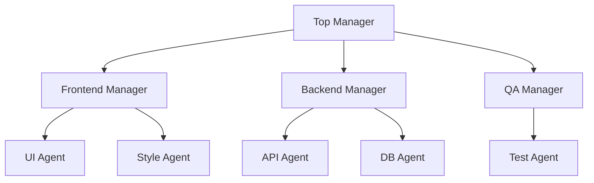

# Hierarchical Decomposition

## Definition

A multi-tier manager-worker structure. Upper levels plan and decompose; lower levels execute and can themselves decompose further.

**Category**: Control structure

## Structure



## When to use

Large engineering projects, long-running work, cross-team collaboration, enterprise process automation.

## When not to use

Small tasks, low-latency tasks, or open chat where task boundaries are not clear.

## How to implement

1. Each tier only handles its own level — no skipping tiers to micromanage workers.
2. Every subtask has explicit acceptance criteria and output schema.
3. Cap recursion depth and per-tier fan-out.
4. Upper tiers only receive summaries, evidence, and status — not full worker context.

## Minimal pseudocode

```ts
async function decompose(node: TaskNode, depth = 0) {
  if (depth > MAX_DEPTH || node.isAtomic()) return worker.run(node);
  const children = await manager.plan(node);
  const results = await Promise.all(children.map(c => decompose(c, depth + 1)));
  return manager.aggregate(node, results);
}
```

## Recommended trace events

- `hierarchy.node.created`
- `hierarchy.node.assigned`
- `hierarchy.node.completed`
- `hierarchy.depth_limited`

## Common failure modes

- Deep hierarchies create high latency.
- A bad plan at the top derails every branch below.
- Worker failures get hidden by manager summaries.

## Implementation checklist

- [ ] Input/output schemas defined.
- [ ] Each agent's permission boundary defined.
- [ ] Every agent call carries a run id / trace id.
- [ ] Failure, timeout, cancel, and retry strategies defined.
- [ ] Context passed is the minimum required, not the full history.
- [ ] High-risk actions are gated by approval or a verifier.

## References

- [Google ADK patterns](https://developers.googleblog.com/developers-guide-to-multi-agent-patterns-in-adk/)
- [Survey of communication](https://arxiv.org/html/2502.14321v2)
