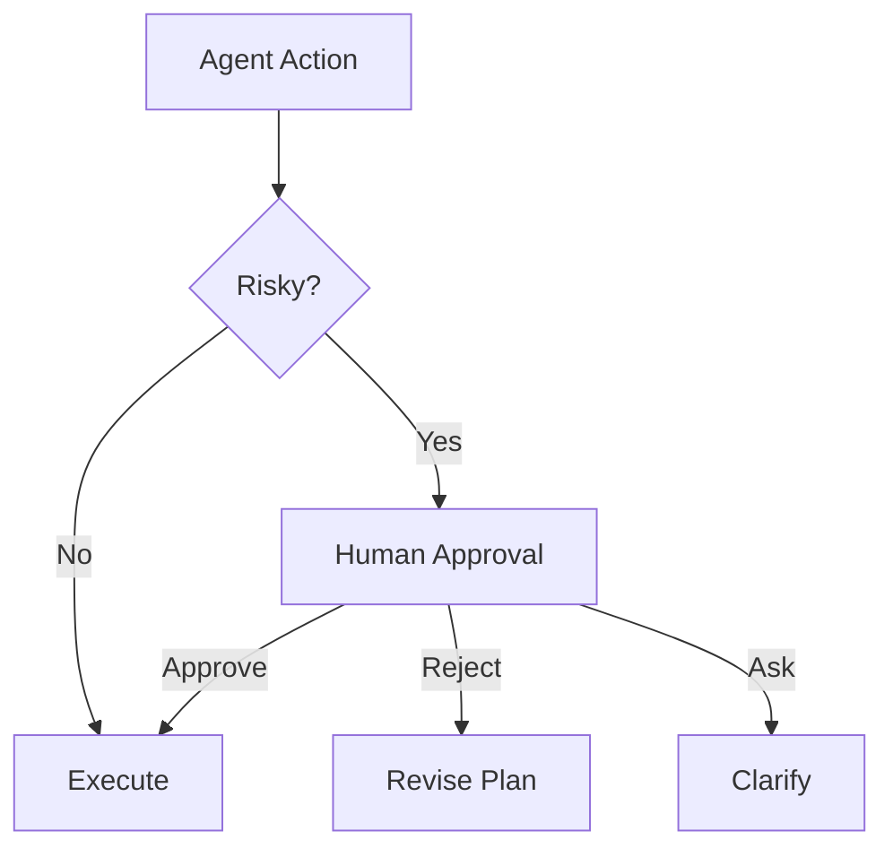

# Human-in-the-loop

## Definition

Treat the human as a special agent that participates in approval, correction, routing, interruption, or final decisions.

**Category**: Execution environment

## Structure



## When to use

High-risk operations: shell, file writes, commits, deploys, financial actions, legal, privacy, permission changes.

## When not to use

Fully automated, low-risk internal drafting work.

## How to implement

1. Define action risk levels: `read / write / shell / network / deploy / payment`.
2. High-risk actions enter an approval queue.
3. Approval cards must show: action, reason, scope, rollback plan.
4. Human feedback flows back into agent state — not just outside commentary.

## Minimal pseudocode

```ts
if (policy.requiresApproval(action)) {
  const approval = await humanApproval.request({ action, reason, rollback });
  if (!approval.granted) return revisePlan(approval.feedback);
}
return execute(action);
```

## Recommended trace events

- `approval.requested`
- `approval.granted`
- `approval.rejected`
- `approval.timeout`

## Common failure modes

- Approval requests don't carry enough context for a real decision.
- Everything requires approval; the system stops being usable.
- After approval, no record of context and accountability.

## Implementation checklist

- [ ] Input/output schemas defined.
- [ ] Each agent's permission boundary defined.
- [ ] Every agent call carries a run id / trace id.
- [ ] Failure, timeout, cancel, and retry strategies defined.
- [ ] Context passed is the minimum required, not the full history.
- [ ] High-risk actions are gated by approval or a verifier.

## References

- [Google ADK patterns](https://developers.googleblog.com/developers-guide-to-multi-agent-patterns-in-adk/)
- [Microsoft Agent Framework](https://learn.microsoft.com/en-us/agent-framework/overview/)
