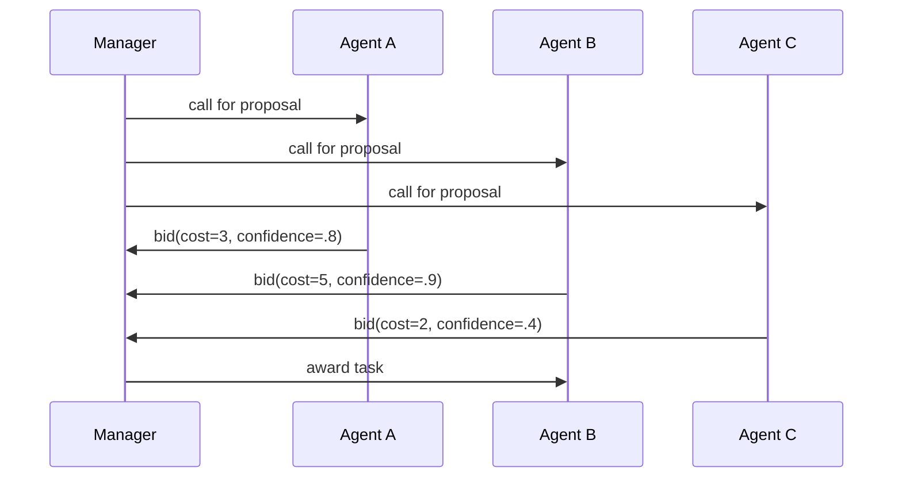

# Market / Auction / Contract Net

## Definition

Agents allocate tasks and resources through bidding, pricing, or the Contract Net Protocol.

**Category**: Decision

## Structure



## When to use

Resource scheduling, tool-cost optimization, robotic task allocation, multi-agent load balancing.

## When not to use

When bids can't be trustworthy estimates, tasks are tiny, or the negotiation cost outweighs execution.

## How to implement

1. The manager publishes a task announcement with goal, constraints, budget, and acceptance criteria.
2. Agents return bids: cost, ETA, confidence, required permissions.
3. The manager picks by a scoring function.
4. Update agent reputation after completion — discourages chronic low-balling.

## Minimal pseudocode

```ts
const bids = await Promise.all(agents.map(a => a.bid(task)));
const winner = rank(bids, b => b.confidence / Math.max(b.cost, 1))[0];
const result = await winner.agent.run(task);
reputation.update(winner.agent, result);
```

## Recommended trace events

- `auction.announced`
- `auction.bid.received`
- `auction.awarded`
- `auction.completed`

## Common failure modes

- Agents underestimate cost.
- The scoring function gets gamed instead of solving the real task.
- Negotiation tokens dominate the budget.

## Implementation checklist

- [ ] Input/output schemas defined.
- [ ] Each agent's permission boundary defined.
- [ ] Every agent call carries a run id / trace id.
- [ ] Failure, timeout, cancel, and retry strategies defined.
- [ ] Context passed is the minimum required, not the full history.
- [ ] High-risk actions are gated by approval or a verifier.

## References

- [Survey of communication](https://arxiv.org/html/2502.14321v2)
