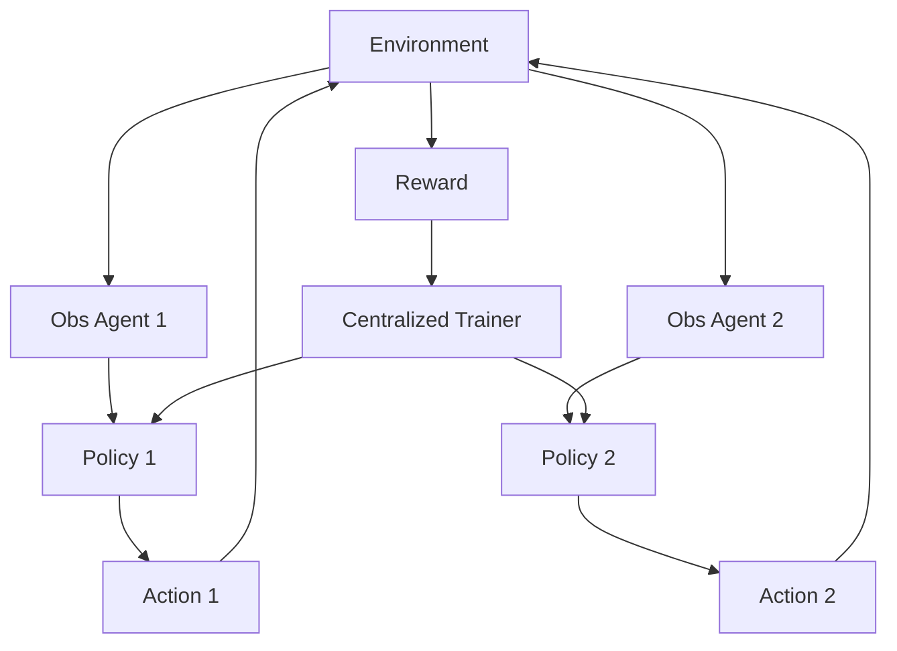

# MARL / CTDE

## Definition

Multi-Agent Reinforcement Learning trains multiple agents to collaborate or compete in an environment through rewards. CTDE means **C**entralized **T**raining, **D**ecentralized **E**xecution.

**Category**: Learning

## Structure



## When to use

Robotics, games, traffic, scheduling, control systems, research on multi-agent collaborative decision making.

## When not to use

Day-to-day LLM coding agent orchestration. If you cannot define a reward and a simulator, don't use MARL.

## How to implement

1. Define environment, observation space, action space, rewards, and episodes.
2. Pick a training paradigm: CTE, CTDE, or DTE.
3. Training can use global state; execution only uses local observations.
4. For LLM agent platforms, MARL is better suited to policy research than as the main runtime.

## Minimal pseudocode

```ts
for (const episode of episodes) {
  let obs = env.reset();
  while (!env.done()) {
    const actions = agents.map((a, i) => a.policy(obs[i]));
    const { nextObs, rewards } = env.step(actions);
    trainer.update({ obs, actions, rewards, nextObs });
    obs = nextObs;
  }
}
```

## Recommended trace events

- `marl.episode.started`
- `marl.step.completed`
- `marl.reward.received`
- `marl.policy.updated`

## Common failure modes

- The reward function is misspecified.
- The training environment doesn't match production.
- Conflating MARL with general LLM orchestration.

## Implementation checklist

- [ ] Trigger and exit conditions defined.
- [ ] Input/output schemas defined.
- [ ] Permission, budget, timeout, and retry policies defined.
- [ ] Trace events defined.
- [ ] Degradation or human-takeover strategies defined.

## References

- [MARL / CTDE intro](https://arxiv.org/abs/2409.03052)
- [MARL survey](https://arxiv.org/abs/2405.06161v2/)
