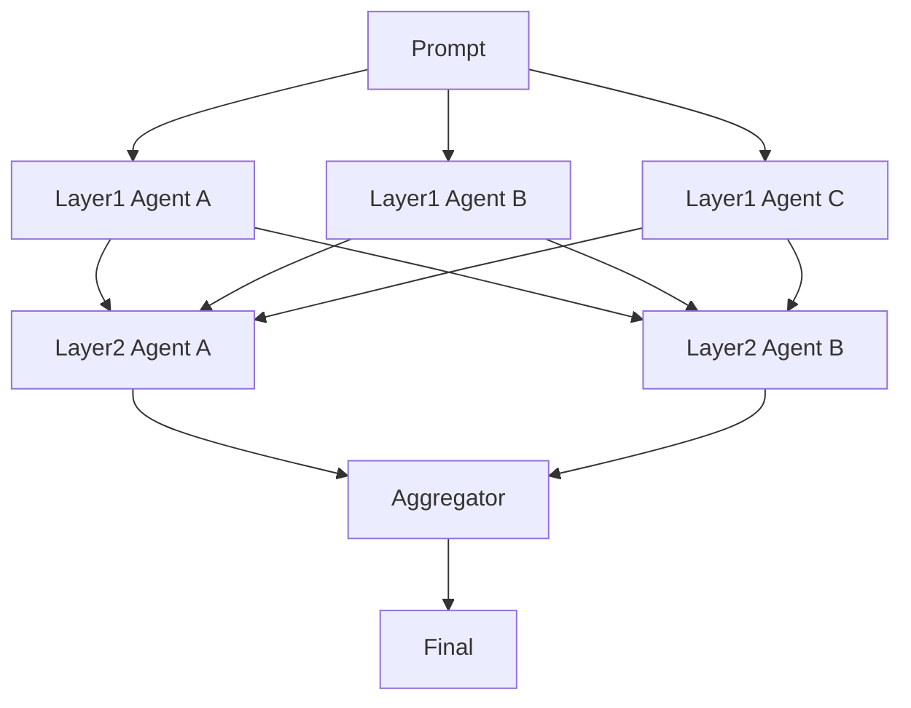

# Mixture-of-Agents / Layered Ensemble

## Definition

Multiple models or agents generate in layers; each subsequent layer reads several prior-layer outputs and improves on them.

**Category**: Decision

## Structure



## When to use

Multi-model fusion, high-quality generation, creative tasks, answer synthesis.

## When not to use

Low-latency tasks, tasks requiring real tool execution, or budget-sensitive workloads.

## How to implement

1. The first layer uses diverse models / prompts to avoid homogeneous output.
2. Subsequent layers read previous outputs, not just the original prompt.
3. The aggregator handles deduplication, conflict resolution, and quality ranking.
4. Cap layer count — 2 or 3 is usually enough.

## Minimal pseudocode

```ts
let layerOutputs = await Promise.all(layer1.map(a => a.run(prompt)));
for (const layer of nextLayers) {
  layerOutputs = await Promise.all(layer.map(a => a.run({ prompt, previous: layerOutputs })));
}
return aggregator.run({ prompt, candidates: layerOutputs });
```

## Recommended trace events

- `moa.layer.started`
- `moa.agent.output`
- `moa.layer.completed`
- `moa.aggregated`

## Common failure modes

- Model outputs are too correlated; gains plateau.
- Latency and cost balloon.
- The aggregator merges conflicting conclusions.

## Implementation checklist

- [ ] Input/output schemas defined.
- [ ] Each agent's permission boundary defined.
- [ ] Every agent call carries a run id / trace id.
- [ ] Failure, timeout, cancel, and retry strategies defined.
- [ ] Context passed is the minimum required, not the full history.
- [ ] High-risk actions are gated by approval or a verifier.

## References

- [Mixture-of-Agents (MoA)](https://arxiv.org/abs/2406.04692)
