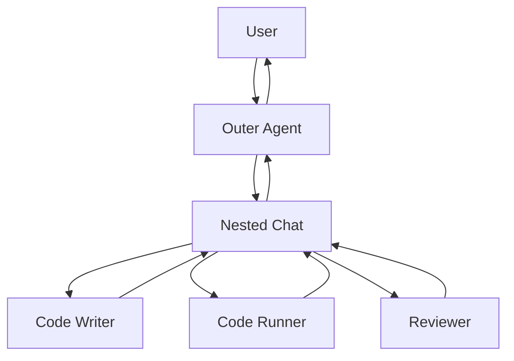

# Nested Chat / Inner Team

## Definition

Before replying to the outside, an agent kicks off a small internal multi-agent conversation to complete a complex subflow.

**Category**: Information flow

## Structure



## When to use

Wrap a complex flow as a single agent, internal review/test loops, reusable specialist teams.

## When not to use

When the user needs to see every intermediate step, or when the inner team's cost is unbounded.

## How to implement

1. The outer agent must have an explicit trigger before launching the nested chat.
2. The nested chat has its own memory and termination condition.
3. The outer agent only receives a structured summary, not the full inner transcript.
4. Trace should preserve the nested run id so it's expandable.

## Minimal pseudocode

```ts
async function outerReply(message) {
  if (needsInternalReview(message)) {
    const inner = await nestedTeam.run({ task: message, maxTurns: 6 });
    return outerAgent.finalize({ message, innerSummary: inner.summary });
  }
  return outerAgent.reply(message);
}
```

## Recommended trace events

- `nested_chat.started`
- `nested_chat.turn`
- `nested_chat.completed`
- `nested_chat.summary.returned`

## Common failure modes

- The inner conversation is invisible and hard to audit.
- The outer agent triggers nested chat too aggressively.
- The inner team's output isn't verified.

## Implementation checklist

- [ ] Input/output schemas defined.
- [ ] Each agent's permission boundary defined.
- [ ] Every agent call carries a run id / trace id.
- [ ] Failure, timeout, cancel, and retry strategies defined.
- [ ] Context passed is the minimum required, not the full history.
- [ ] High-risk actions are gated by approval or a verifier.

## References

- [AutoGen patterns](https://microsoft.github.io/autogen/0.2/docs/tutorial/conversation-patterns/)
