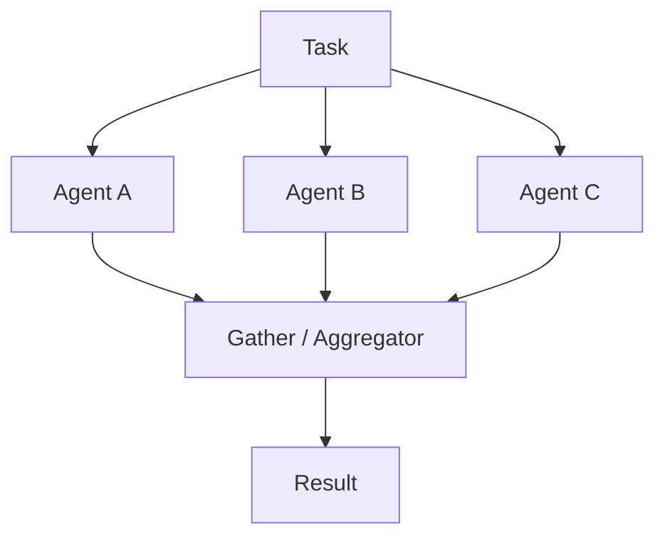

# Parallel Fan-out / Gather

## Definition

Split a task across multiple agents that execute concurrently, then an aggregator merges, votes on, or synthesizes the results.

**Category**: Information flow

## Structure



## When to use

Multi-perspective exploration, parallel retrieval, parallel code reading, log analysis, model ensembling.

## When not to use

When the task is strongly order-dependent, when branches need shared mutable state, or when the budget is tight.

## How to implement

1. Before fanning out, give each branch a distinct goal — avoid duplicated work.
2. Branches share read-only context by default, never the workspace.
3. The gather step does deduplication, conflict detection, and evidence merging — not naive concatenation.
4. Configure concurrency, timeouts, cancellation, and budget caps.

## Minimal pseudocode

```ts
const branches = plan.branches.map(branch =>
  runWithTimeout(agentFor(branch).run(branch), branch.timeoutMs)
);
const results = await Promise.allSettled(branches);
return aggregator.run({ task, results });
```

## Recommended trace events

- `fanout.started`
- `branch.started`
- `branch.completed`
- `branch.timeout`
- `gather.started`
- `gather.completed`

## Common failure modes

- Multiple agents do the same work.
- The aggregator silently merges contradictory conclusions.
- Concurrent writes corrupt a shared workspace.

## Implementation checklist

- [ ] Input/output schemas defined.
- [ ] Each agent's permission boundary defined.
- [ ] Every agent call carries a run id / trace id.
- [ ] Failure, timeout, cancel, and retry strategies defined.
- [ ] Context passed is the minimum required, not the full history.
- [ ] High-risk actions are gated by approval or a verifier.

## References

- [Google ADK patterns](https://developers.googleblog.com/developers-guide-to-multi-agent-patterns-in-adk/)
