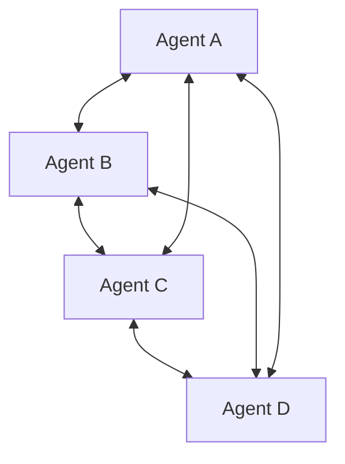

# Peer-to-peer / Swarm

## Definition

There is no fixed coordinator. Agents self-organize through direct communication, a shared environment, or dynamic handoff.

**Category**: Control structure

## Structure



## When to use

Open worlds, decentralized networks, dynamic exploration, research systems, autonomous agent societies.

## When not to use

Enterprise production flows, environments with strict permissions, anywhere strong audit and determinism are required.

## How to implement

1. Each agent keeps local state and a neighbor list.
2. Use a message protocol; do not depend on a single coordinator.
3. Set TTL, visited set, and budget to prevent flooding.
4. When you need a global result, introduce a temporary aggregator or consensus mechanism.

## Minimal pseudocode

```ts
async function receive(msg) {
  if (seen(msg.id) || msg.ttl <= 0) return;
  markSeen(msg.id);
  const local = await act(msg);
  for (const peer of pickPeers(local)) {
    send(peer, { ...msg, ttl: msg.ttl - 1, context: local.summary });
  }
}
```

## Recommended trace events

- `peer.message.sent`
- `peer.message.received`
- `peer.route.selected`
- `swarm.consensus.reached`

## Common failure modes

- Hard to converge.
- Duplicated work.
- Weak security boundaries.
- Difficult accountability.

## Implementation checklist

- [ ] Input/output schemas defined.
- [ ] Each agent's permission boundary defined.
- [ ] Every agent call carries a run id / trace id.
- [ ] Failure, timeout, cancel, and retry strategies defined.
- [ ] Context passed is the minimum required, not the full history.
- [ ] High-risk actions are gated by approval or a verifier.

## References

- [Survey of communication](https://arxiv.org/html/2502.14321v2)
