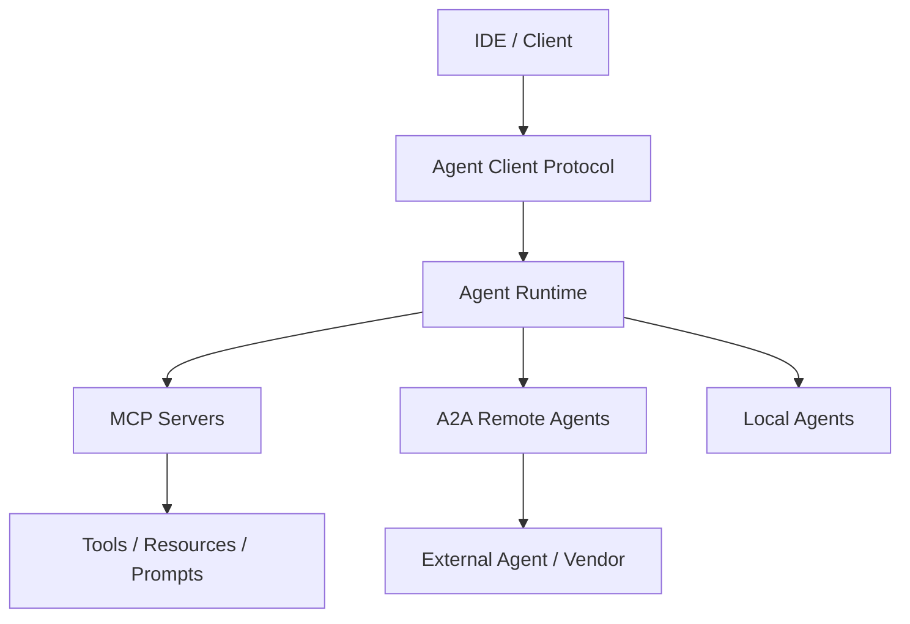

# Protocol-mediated Agent Network

## Definition

Use standard protocols — MCP, A2A, ACP, Agent Client Protocol — to connect tools, agents, clients, and platforms across frameworks and vendors.

**Category**: Protocol interconnect

## Structure



## When to use

Cross-framework interop, enterprise integration, IDE-to-coding-agent, tool ecosystem standardization.

## When not to use

Monolithic demos, environments where every tool is local and no standardization is required.

## How to implement

1. MCP is for agent-to-tool/resource calls — don't reuse it for agent-to-agent communication.
2. A2A / ACP handles agent discovery, tasks, messages, and collaboration.
3. The Agent Client Protocol covers IDE/client to coding-agent links.
4. All protocol boundaries require auth, authorization, audit, and rate limits.

## Minimal pseudocode

```ts
interface AgentRuntimePorts {
  mcp: MCPClient;                 // tools / resources / prompts
  a2a: AgentDirectoryClient;      // remote agents
  client: AgentClientServer;      // IDE / web / CLI
  events: EventBus;               // observability
}
```

## Recommended trace events

- `protocol.mcp.tool_call`
- `protocol.a2a.task.created`
- `protocol.client.session.started`
- `protocol.auth.failed`

## Common failure modes

- Conflating MCP, A2A, and Agent Client Protocol into a single protocol.
- External agents granted too much permission.
- No identity or audit.

## Implementation checklist

- [ ] Input/output schemas defined.
- [ ] Each agent's permission boundary defined.
- [ ] Every agent call carries a run id / trace id.
- [ ] Failure, timeout, cancel, and retry strategies defined.
- [ ] Context passed is the minimum required, not the full history.
- [ ] High-risk actions are gated by approval or a verifier.

## References

- [MCP specification](https://modelcontextprotocol.io/specification/2025-06-18)
- [MCP tools](https://modelcontextprotocol.io/specification/2025-06-18/server/tools)
- [A2A docs](https://a2a-protocol.org/latest/)
- [A2A — Google blog](https://developers.googleblog.com/en/a2a-a-new-era-of-agent-interoperability/)
- [Agent Client Protocol](https://agentclientprotocol.com/get-started/introduction)
