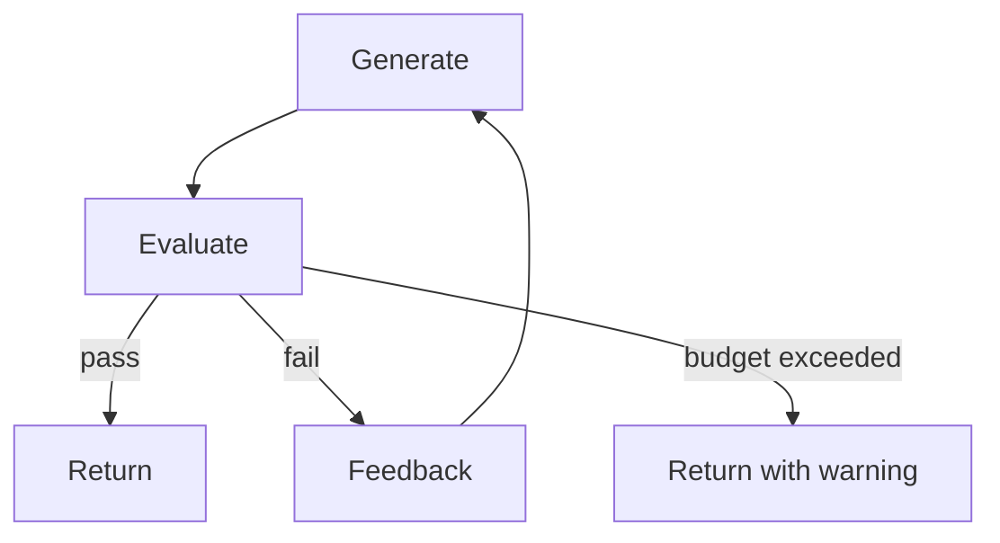

# Refinement Loop / Evaluator-Optimizer

## Definition

Iterate generation → evaluation → revision until an exit condition is met or the budget is exhausted.

**Category**: Decision

## Structure



## When to use

Test-driven code repair, document polishing, prompt optimization, plan iteration, quality gates.

## When not to use

When there's no clear evaluation criterion, no defined exit condition, or budget is tight.

## How to implement

1. Define exit conditions up front: tests passing, score above threshold, human approval, no new issues.
2. Each round only modifies explicit failure points — avoid oscillation.
3. Log per-round diff, score, feedback, and cost.
4. On max-rounds, return current state and unresolved issues.

## Minimal pseudocode

```ts
for (let round = 1; round <= maxRounds; round++) {
  const output = await worker.run(state);
  const evalResult = await evaluator.run(output);
  logRound(round, output, evalResult);
  if (evalResult.pass) return output;
  state = applyFeedback(state, evalResult.feedback);
}
return { status: "incomplete", state };
```

## Recommended trace events

- `loop.round.started`
- `loop.evaluation.completed`
- `loop.exit.pass`
- `loop.exit.budget_exceeded`

## Common failure modes

- Vague exit conditions create infinite loops.
- Each round introduces new bugs.
- The system optimizes the evaluator's score, not the real goal.

## Implementation checklist

- [ ] Input/output schemas defined.
- [ ] Each agent's permission boundary defined.
- [ ] Every agent call carries a run id / trace id.
- [ ] Failure, timeout, cancel, and retry strategies defined.
- [ ] Context passed is the minimum required, not the full history.
- [ ] High-risk actions are gated by approval or a verifier.

## References

- [Google ADK patterns](https://developers.googleblog.com/developers-guide-to-multi-agent-patterns-in-adk/)
- [Google architecture patterns](https://docs.cloud.google.com/architecture/choose-design-pattern-agentic-ai-system)
