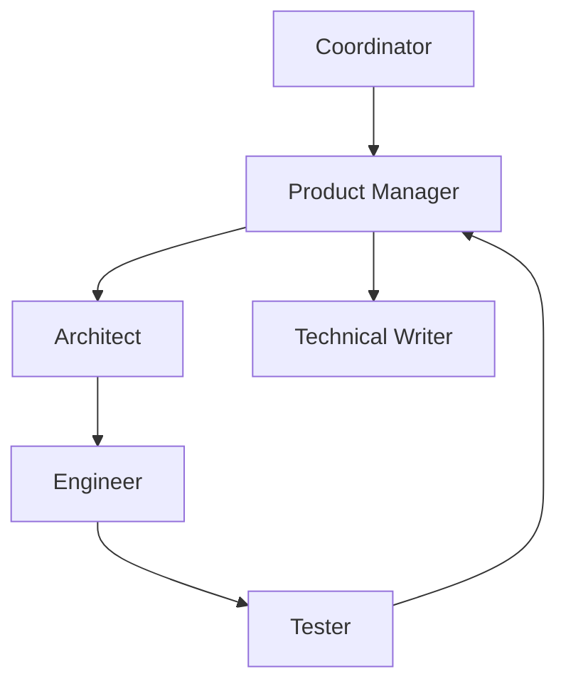

# Role-playing / SOP / Virtual Company

## Definition

Assign agents professional roles — product, architect, dev, QA — and constrain their collaboration with a Standard Operating Procedure.

**Category**: Execution environment

## Structure



## When to use

Virtual software companies, product design, teaching simulations, organizational process automation.

## When not to use

When roles are decorative — no tools, no acceptance criteria.

## How to implement

1. Each role declares responsibility boundary, allowed tools, and input/output formats.
2. The SOP is encoded as a workflow, not just buried in a prompt.
3. Role handoffs produce artifacts, not just chat logs.
4. For software-development tasks, plug in real test execution and code running.

## Minimal pseudocode

```ts
const sop = [
  { role: "PM", output: "requirements.md" },
  { role: "Architect", output: "design.md" },
  { role: "Engineer", output: "patch.diff" },
  { role: "Tester", output: "test-report.md" },
];

for (const step of sop) await role(step.role).run(step);
```

## Recommended trace events

- `role.task.started`
- `role.artifact.created`
- `sop.step.completed`
- `sop.violation.detected`

## Common failure modes

- Agents play the role well but produce no real output.
- The SOP balloons in length and cost.
- Role outputs don't follow a consistent artifact format.

## Implementation checklist

- [ ] Input/output schemas defined.
- [ ] Each agent's permission boundary defined.
- [ ] Every agent call carries a run id / trace id.
- [ ] Failure, timeout, cancel, and retry strategies defined.
- [ ] Context passed is the minimum required, not the full history.
- [ ] High-risk actions are gated by approval or a verifier.

## References

- [Survey: LLM-based multi-agent](https://arxiv.org/html/2412.17481v2)
