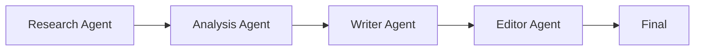

# Sequential Pipeline

## Definition

Tasks pass through multiple agents in a fixed order; the output of each step becomes the input of the next.

**Category**: Information flow

## Structure



## When to use

Research → analyze → write, requirements → design → build → test, ETL-style well-defined flows.

## When not to use

When the task structure is unknown, or when you need heavy dynamic branching or parallel exploration.

## How to implement

1. Model the flow as fixed steps; each step declares input/output schemas.
2. Validate every step's output — don't pass raw natural language between steps.
3. Allow per-step retry on failure rather than re-running the whole pipeline.
4. Insert a verifier or human approval at critical nodes.

## Minimal pseudocode

```ts
const pipeline = [researchAgent, analystAgent, writerAgent, editorAgent];
let state = { input: userTask };
for (const agent of pipeline) {
  state = await agent.run(state);
  validate(agent.outputSchema, state);
}
return state.final;
```

## Recommended trace events

- `pipeline.started`
- `pipeline.step.started`
- `pipeline.step.completed`
- `pipeline.completed`

## Common failure modes

- Upstream hallucinations get repackaged downstream as more credible.
- Fixed flows don't fit dynamic tasks.
- Missing per-step checkpoints.

## Implementation checklist

- [ ] Input/output schemas defined.
- [ ] Each agent's permission boundary defined.
- [ ] Every agent call carries a run id / trace id.
- [ ] Failure, timeout, cancel, and retry strategies defined.
- [ ] Context passed is the minimum required, not the full history.
- [ ] High-risk actions are gated by approval or a verifier.

## References

- [Google ADK patterns](https://developers.googleblog.com/developers-guide-to-multi-agent-patterns-in-adk/)
- [AutoGen patterns](https://microsoft.github.io/autogen/0.2/docs/tutorial/conversation-patterns/)
