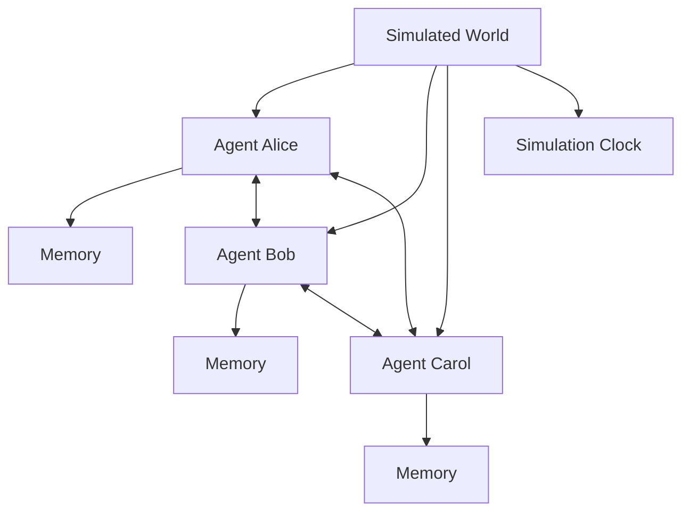

# Social Simulation / Agent Society

## Definition

Use multiple agents to simulate a crowd, organization, community, or social system. The focus is long-term memory, planning, relationships, and emergent behavior.

**Category**: Simulation

## Structure



## When to use

User research, product validation, social behavior simulation, game NPCs, organizational modeling, information-propagation studies.

## When not to use

Production task execution, strongly deterministic flows, anything that needs a coding agent to perform real work.

## How to implement

1. Design world state: locations, time, events, objects, relationships.
2. Each agent has memory, profile, goals, and a daily plan.
3. Use an `observe → reflect → plan → act` loop.
4. Record agent interactions and world-state changes.
5. The goal is simulation credibility, not single-task success rate.

## Minimal pseudocode

```ts
async function tick(world) {
  for (const agent of world.agents) {
    const obs = world.observe(agent);
    agent.memory.store(obs);
    const reflection = await agent.reflect();
    const plan = await agent.plan(reflection);
    await world.apply(await agent.act(plan));
  }
}
```

## Recommended trace events

- `simulation.tick.started`
- `agent.observed`
- `agent.reflected`
- `agent.acted`
- `world.state.updated`

## Common failure modes

- Treating simulation results as real predictions.
- Persona is convincing but behavior isn't verified.
- Long-term memory pollutes future runs.

## Implementation checklist

- [ ] Trigger and exit conditions defined.
- [ ] Input/output schemas defined.
- [ ] Permission, budget, timeout, and retry policies defined.
- [ ] Trace events defined.
- [ ] Degradation or human-takeover strategies defined.

## References

- [Generative agents](https://arxiv.org/abs/2304.03442)
