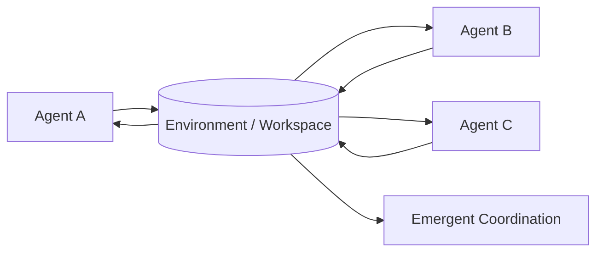

# Stigmergy / Environment-mediated Collaboration

## Definition

Agents do not communicate directly. They modify the environment and leave traces; other agents observe those traces and act. For coding agents, issues, todos, diffs, and test results are all environmental traces.

**Category**: Execution environment

## Structure



## When to use

Robotics, simulation, manufacturing, shared workspaces, async research collaboration — anywhere direct conversation is unnecessary.

## When not to use

When environment state isn't observable, traces have no schema, or strong causal explanations are required.

## How to implement

1. Structure environment traces: `todo / artifact / test_result / issue / decision`.
2. Agents periodically observe environment changes rather than receiving direct messages.
3. Each trace carries source, timestamp, validity, confidence.
4. For coding agents, treat `TODO.md`, test reports, git diffs as stigmergic signals.

## Minimal pseudocode

```ts
async function agentLoop(agent) {
  const observations = await environment.observe(agent.scope);
  const action = await agent.decide(observations);
  await environment.apply(action);
  await eventBus.publish({
    type: "environment.trace.left",
    actor: agent.id,
    payload: action,
  });
}
```

## Recommended trace events

- `environment.observed`
- `environment.trace.left`
- `environment.trace.consumed`
- `environment.conflict.detected`

## Common failure modes

- Environment pollution.
- Agents read stale traces.
- Traces are too implicit and debugging is painful.

## Implementation checklist

- [ ] Trigger and exit conditions defined.
- [ ] Input/output schemas defined.
- [ ] Permission, budget, timeout, and retry policies defined.
- [ ] Trace events defined.
- [ ] Degradation or human-takeover strategies defined.

## References

- [Survey of communication](https://arxiv.org/html/2502.14321v2)
