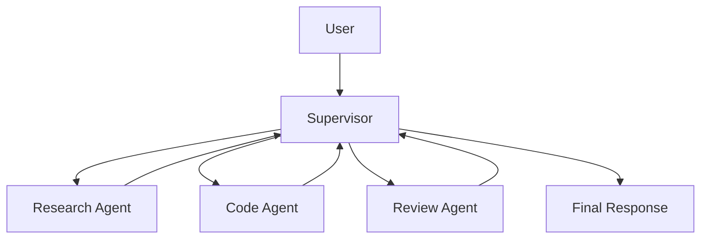

# Supervisor / Manager

## Definition

A primary agent plans, routes, and synthesizes results; other agents act as specialists that execute subtasks.

**Category**: Control structure

## Structure



## When to use

Production systems, task decomposition, customer-support triage, internal R&D platforms, anywhere you need stable control and observability.

## When not to use

Open-ended exploration, free-form negotiation among agents, or cases where the supervisor cannot meaningfully evaluate subtask quality.

## How to implement

1. Define a `SupervisorAgent` that does only intent recognition, planning, routing, and synthesis — never the heavy lifting.
2. Each specialist has its own instructions, tool set, memory scope, and permissions.
3. When the supervisor calls a sub-agent it passes a structured task: `goal / context / constraints / expected_output`.
4. Sub-agents return structured results: `status / answer / evidence / next_actions / confidence`.
5. The supervisor decides next: call again, fan out in parallel, enter a verifier, request user confirmation, or finalize.

## Minimal pseudocode

```ts
type AgentResult = {
  status: "success" | "blocked" | "need_input" | "failed";
  answer: string;
  evidence?: string[];
  confidence?: number;
};

async function supervisor(task: UserTask) {
  const plan = await planner.run(task);
  const results = [];
  for (const step of plan.steps) {
    const agent = registry.pick(step.requiredSkill);
    results.push(await agent.run({ goal: step.goal, context: task.context }));
  }
  return synthesizer.run({ task, results });
}
```

## Recommended trace events

- `supervisor.plan.created`
- `agent.task.assigned`
- `agent.result.received`
- `supervisor.synthesis.completed`

## Common failure modes

- The supervisor becomes a bottleneck; every error concentrates on one node.
- Sub-agent outputs are not verifiable; the supervisor blindly trusts them.
- Full context is dumped into the supervisor, exploding tokens and erasing permission boundaries.

## Implementation checklist

- [ ] Input/output schemas defined.
- [ ] Each agent's permission boundary defined.
- [ ] Every agent call carries a run id / trace id.
- [ ] Failure, timeout, cancel, and retry strategies defined.
- [ ] Context passed is the minimum required, not the full history.
- [ ] High-risk actions are gated by approval or a verifier.

## References

- [OpenAI Agents — guide](https://developers.openai.com/api/docs/guides/agents)
- [LangChain multi-agent](https://docs.langchain.com/oss/python/langchain/multi-agent)
- [Google ADK patterns](https://developers.googleblog.com/developers-guide-to-multi-agent-patterns-in-adk/)
