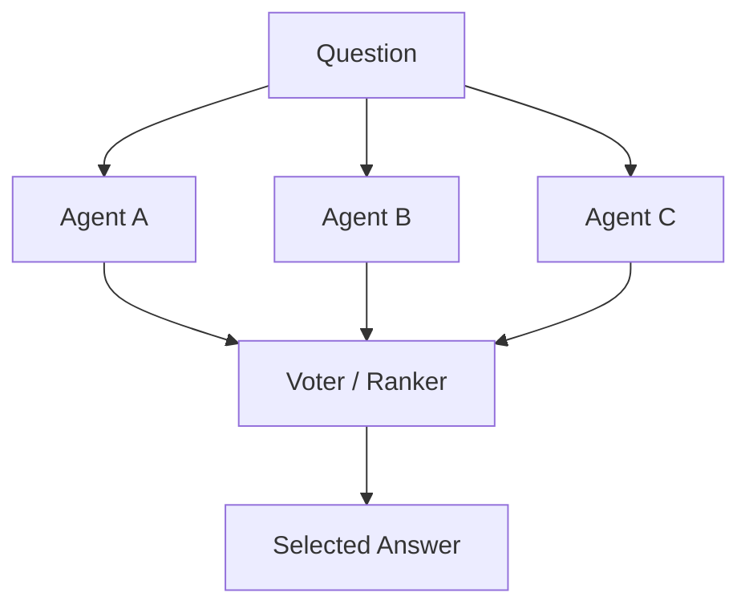

# Voting / Ensemble

## Definition

Multiple agents produce candidate answers independently; a vote, ranking, score, or verifier selects the final result.

**Category**: Decision

## Structure



## When to use

Classification, reasoning problems, multiple candidate plans, fact checking, model fusion, benchmark evaluation.

## When not to use

When candidates are highly correlated, when all agents share the same error source, or when the task needs tool verification rather than a vote.

## How to implement

1. Use different models, prompts, temperatures, or tool paths to maximize diversity.
2. Each candidate carries reasoning and evidence so the ranker can judge.
3. Rankers use a rubric, not "what looks best."
4. For executable tasks, verify the winning candidate with a tool.

## Minimal pseudocode

```ts
const candidates = await Promise.all(agents.map(a => a.answer(question)));
const scored = await ranker.score({ question, candidates, rubric });
const winner = scored.sort((a, b) => b.score - a.score)[0];
return verifier ? verifier.check(winner) : winner;
```

## Recommended trace events

- `ensemble.candidate.created`
- `ensemble.vote.cast`
- `ensemble.ranked`
- `ensemble.winner.selected`

## Common failure modes

- Majority isn't correct.
- Candidates are too similar.
- The ranker is fooled by fluent prose.

## Implementation checklist

- [ ] Trigger and exit conditions defined.
- [ ] Input/output schemas defined.
- [ ] Permission, budget, timeout, and retry policies defined.
- [ ] Trace events defined.
- [ ] Degradation or human-takeover strategies defined.

## References

- [Survey: LLM-based multi-agent](https://arxiv.org/html/2412.17481v2)
- [Mixture-of-Agents (MoA)](https://arxiv.org/abs/2406.04692)
