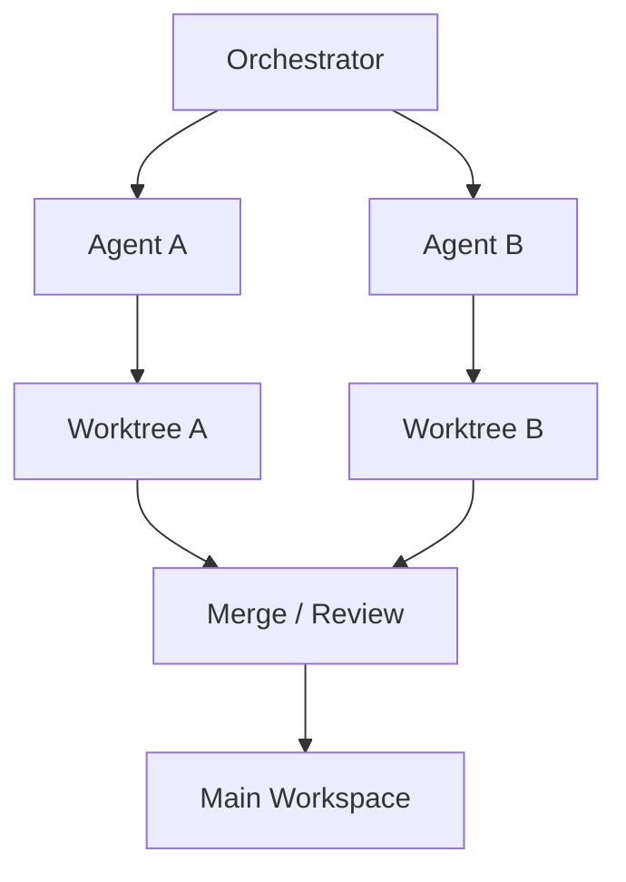

# Workspace / Sandbox Isolation

## Definition

Different agents execute in distinct workspaces, git worktrees, containers, or sandboxes to avoid concurrent corruption.

**Category**: Execution environment

## Structure



## When to use

Coding agents, multi-agent concurrent code changes, experimental approaches, dangerous commands, test-environment isolation.

## When not to use

Read-only tasks, simple Q&A, anything without filesystem side effects.

## How to implement

1. Each agent run creates its own workspace or worktree.
2. File writes, shells, and tests all run inside the isolated environment.
3. Outputs return to the main flow as patch / diff / artifact.
4. Before merging, a reviewer/tester checks conflicts and test results.
5. Support snapshot, rollback, cleanup.

## Minimal pseudocode

```ts
async function runInWorkspace(agent, task) {
  const ws = await workspace.create({ baseRef: task.baseRef });
  try {
    const result = await agent.run({ task, cwd: ws.path });
    const patch = await ws.diff();
    return reviewer.review({ result, patch });
  } finally {
    await ws.cleanup();
  }
}
```

## Recommended trace events

- `workspace.created`
- `workspace.command.executed`
- `workspace.diff.created`
- `workspace.cleaned`

## Common failure modes

- Multiple agents writing to the same directory.
- Only text summaries returned, no diff.
- Sandbox permissions too broad.
- No cleanup strategy → resource leaks.

## Implementation checklist

- [ ] Trigger and exit conditions defined.
- [ ] Input/output schemas defined.
- [ ] Permission, budget, timeout, and retry policies defined.
- [ ] Trace events defined.
- [ ] Degradation or human-takeover strategies defined.

## References

- [Google ADK patterns](https://developers.googleblog.com/developers-guide-to-multi-agent-patterns-in-adk/)
